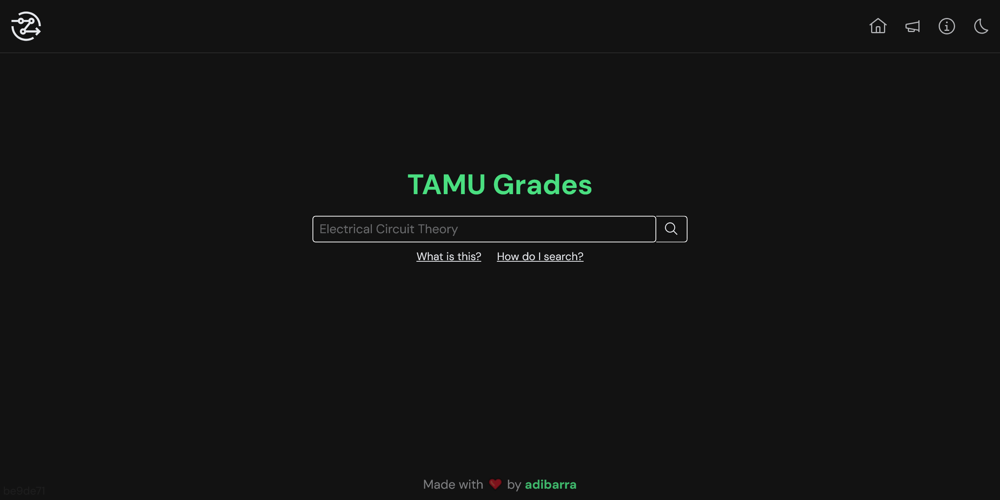

<h1 align="center">
  
  

    TAMU Grades
  

</h1>

## Overview

TAMU Grades is a web app that allows users to search for courses taught at Texas A&M University and view statistics about them. The goal is to provide a simple and intuitive interface for students to analyze historical data about courses and professors to help them make informed decisions when choosing their classes.

The project's repo is currently private. This repo should be used for issue tracking and feature requests.

The project can be seen in action at [here](https://grades.adibarra.com/).

